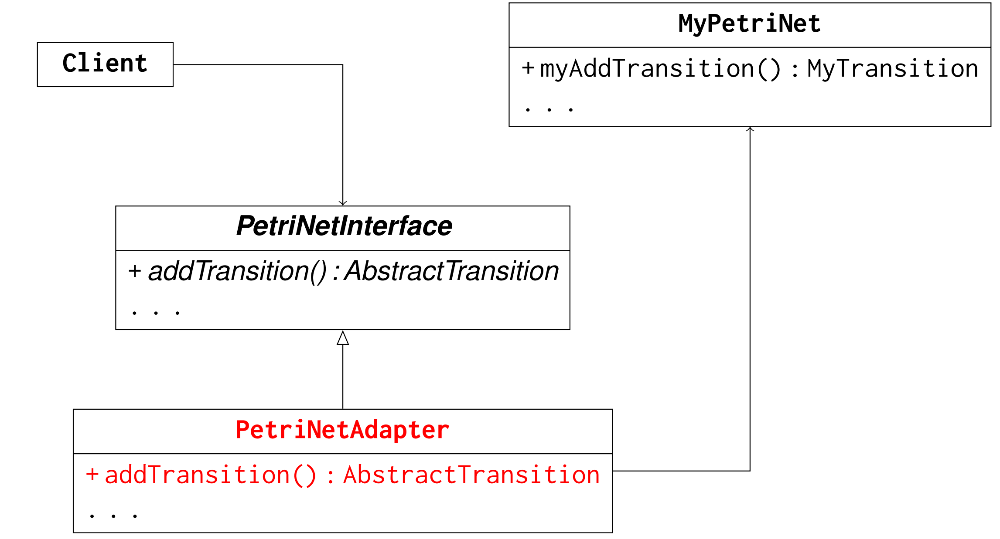
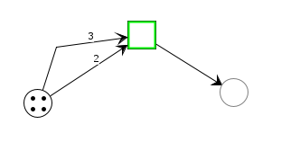
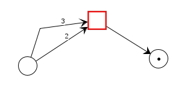
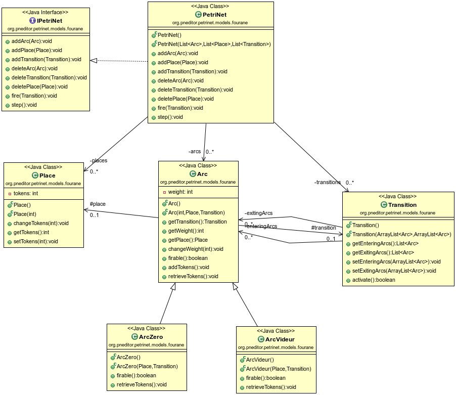

# PetriNet Implementation Integration into a PetriNet Editor using the Adapter Design Pattern

In this project, we integrated our implementation of The PetriNet system found in [PetriNet Repository](https://github.com/badr4y/PetriNet) into a PetriNet Editor using the Adapter design pattern. To do that, we put our own implementation(To find more information about our model, see https://github.com/badr4y/PetriNet) in this package `src/org/pneditor/petrinet/models/fourane` and then implemented our own adapters (ArcAdapter, PlaceAdapter, TransitionAdapter, PetriNetAdapter) in the `org.pneditor.petrinet.adapters.fourane` package.

## Adapters
In this project, we have implemented a series of adapters that serve as bridges, effectively connecting our custom PetriNet model to the editor interface. These adapters enable client code to interact through a unified interface, PetriNetInterface, without concerning itself with the specifics of the underlying implementation.

Here are explainations of our 5 adapters.
### 1. ArcAdapter

The `ArcAdapter` class serves as a bridge between the underlying implementation of Arc, ArcVideur, and ArcZero in the `Arc` package and the Editor interface. This adapter class includes methods to set the direction of the arc, retrieve the associated Place or Transition, and manage the link between the arc and its associated transition.

### 2. PlaceAdapter

The `PlaceAdapter` class links the implementation of the Place in the `Place` package with the Editor interface. It includes methods for adding and removing tokens, getting the current number of tokens, and setting the number of tokens for a Place.

### 3. TransitionAdapter

The `TransitionAdapter` class acts as an adapter between the implementation of Transition in the `Transition` package and the Editor interface. It includes methods to retrieve the associated Transition.

### 4. PetriNetAdapter

The `PetriNetAdapter` class is a comprehensive adapter that connects the Editor interface with the underlying Petri Net implementation. It manages the creation and removal of Places, Transitions, and Arcs. Additionally, it provides methods for checking enablement, firing transitions, and handling various types of arcs.

### 5. ArcType

The `ArcType` enum categorizes arcs into three types: Regular, Reset, and Inhibitory. This enum simplifies the identification of the arc type during the creation process.

## Usage

1. **Build and Run:**
   - Build the project.

2. **Run the Editor:**
   - Execute `src.org.pneditor.editor.Main` as a Java application.
   - Select the desired model (initial, imta, or our model **fourane**) from the menu.

3. **Build your own Petri Net graphically:**
   - Create places and transitions and link them with Arcs, set the type of the arc to your desired type, set the number of tokens for each Place and fire the transitions as you want.

## Additional Notes

In contrast to the initial and imta models, our model **fourane** can handle and thus create doubled Arcs (Two Arcs or more with the same destination and source).

- **Before Transition:**  
  

- **After Transition:**  
  

## The final class diagram
UML class diagram of our model :

## License and Acknowledgments

- Code License: GNU GPL v3.
- The original Petri Net Editor (PNE) is available at [www.pneditor.org](www.pneditor.org).

Requirements: Java SE 8+
